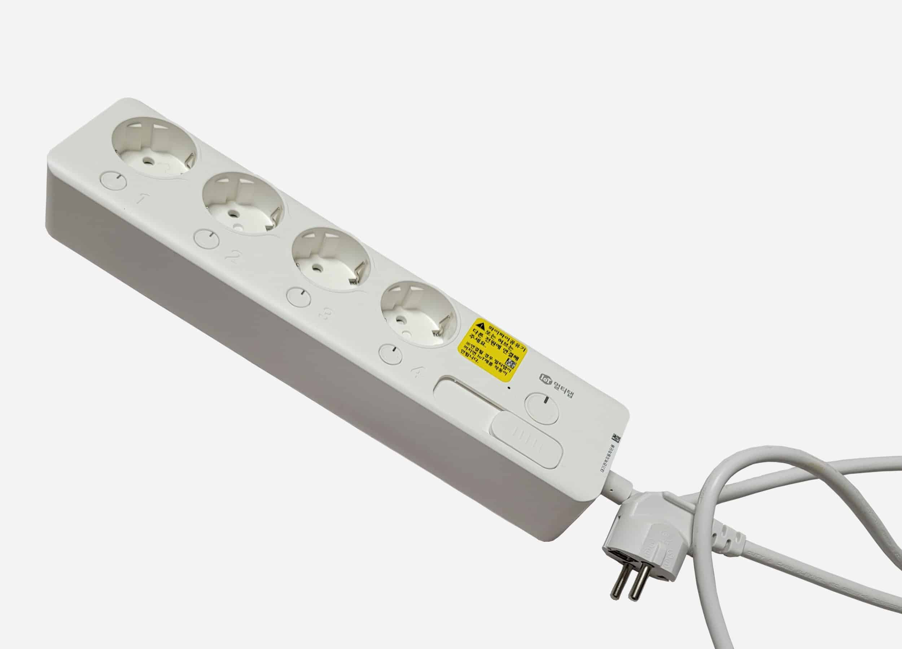
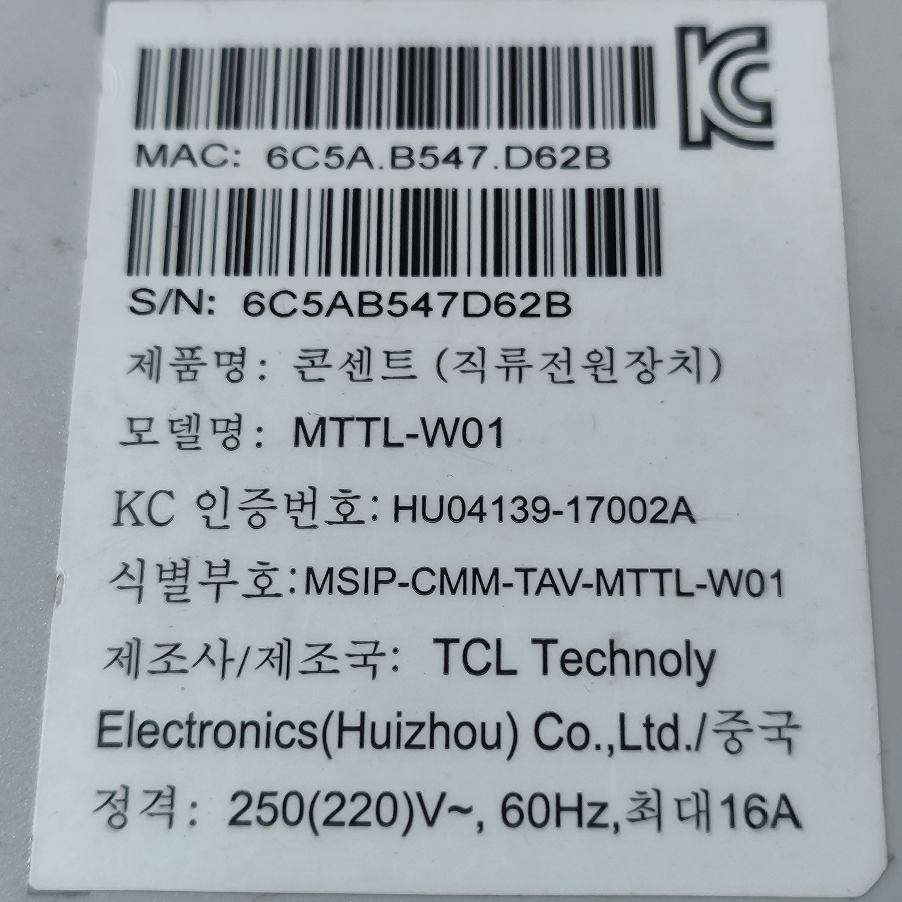
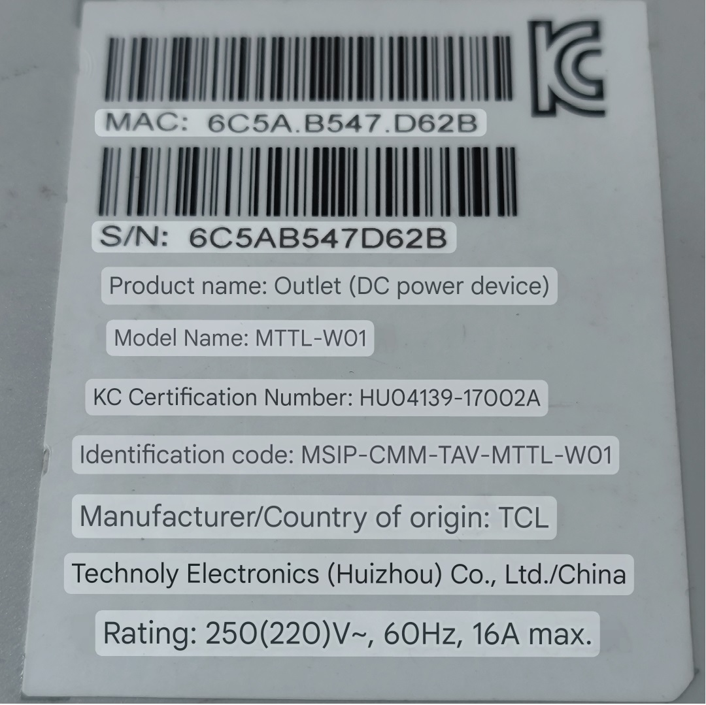

# Korean_LG_TCL_MTTL-w01_power-strip
Reverse Engineering The Korean LG TCL MTTL-w01 power-strip

# Product Information

Product's image:

  

I got the Product's image from this [website](https://www.trend-pc.com/product/%D9%85%D8%B4%D8%AA%D8%B1%D9%83-lg-mttl-w01/)

Product's Badge:

  

Translated picture:

  

## Product Information:
* Product Name: Outlet (DC power device)
* Model Name: MTTL-W01
* KC Certification Number: HU04139-17002A
* Identification Code: MSIP-CMM-TAV-MTTL-W01
* Manufacturer/Country of origin: TCL Technology Electronics (Huizhou) Co., LTD./China
* Rating: 250(220)V~, 60Hz, 16A max.

# Safety First - Disclaimer
Warning: This power strip works with 220V (mains voltage); all parts are referenced to 220V. All your tools must be totally isolated from your computer; otherwise, your computer could explode if you make any mistakes. It could even damage any device that is connected to it. I am not responsible for any damage or injuries that occur to anyone. Don't try this at home. You are doing this at your own risk.

You should have the following tools:
* Isolation transformer 220V/220V - (No Earthing on the output).
* [USB Isolators](https://www.adafruit.com/product/2107), this one from Adafruit is enought. You should have at least two.
* Logic analyzer.
* Multimeter.
* USB to Serial Converter.

# Introduction
This power strip is well known here in Egypt; it costs around 400 EGPs. It's well designed and has good components inside. It has a dual-pole latching relay for each outlet, a current measurement AFE for each output, push buttons for controlling each output, and status LEDs for each outlet too. This power strip is controlled by a mobile application through WiFi. Unfortunately, the IOT smart function only works in Korea, and the only available function is to control the outlets using the push buttons.

This power strip has dual USB outlets for charging various devices.

My target here is to find a way to enable this WiFi IOT function even if we rewrite its firmware again. We will go through various steps to reach our goal.

# Our plan
* Trying to identify all ICs on all PCBs.
* Trying to find all useful test points.
* Mapping all test points to the GPIOs.
* Mapping all test points to all hardware devices on PCBs.
* Drawing a block diagram with all identified test points for all communication busses.
* Trying to dump the firmware.
* Reverse Engineering the dumped firmware.
* Sniffing all communication busses.
* Rewriting the FW again.